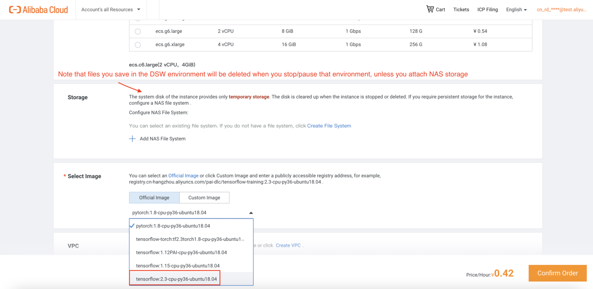
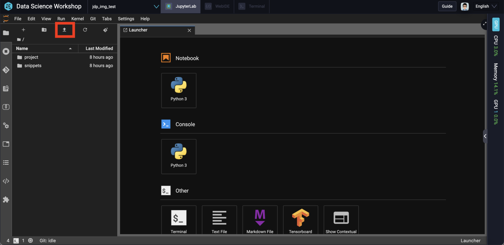
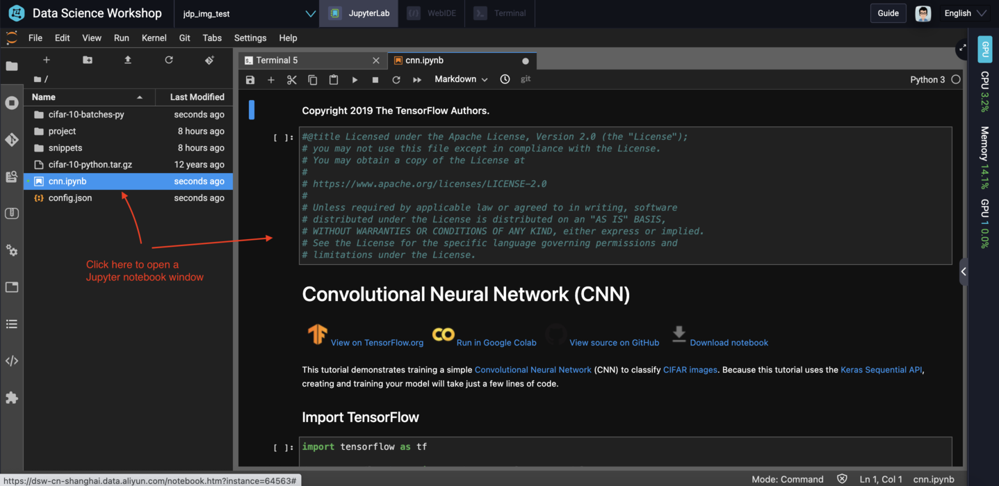
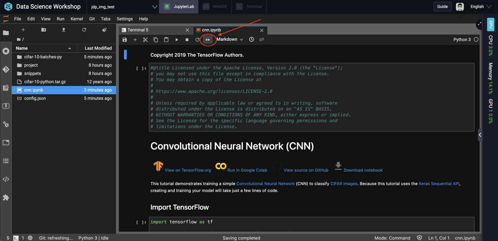
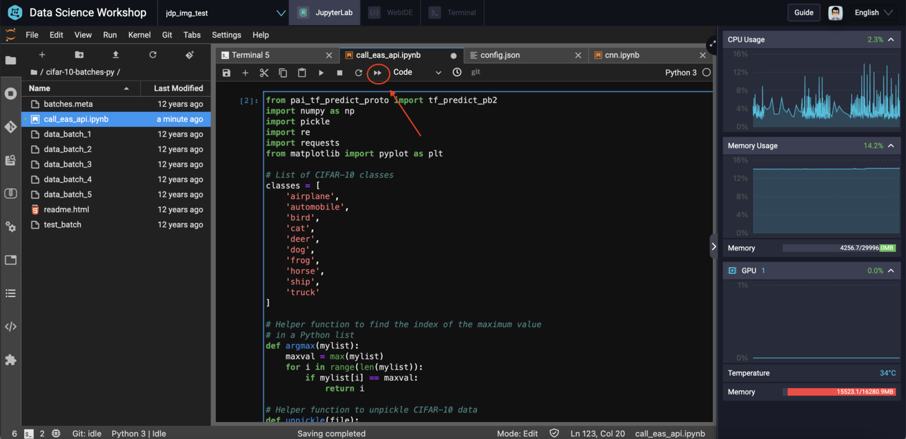

# Build An Image Recognition API with PAI-DSW and PAI-EAS 

- Status: **OK**
- Notes: Code tested and working as of 2021-06-16 (YYYY-MM-DD)

**License Note**: Some of the code here (namely `cnn.ipynb`) is borrowed from [tensorflow.org](https://tensorflow.org) and therefore that code (and any changes we have made to it) remains under an Apache license (see the license notes at the top of `cnn.ipynb` for details.

Use the code here to test and train a Convolutional Neural Network (CNN) to recognize the images in the [CIFAR-10](https://www.cs.toronto.edu/~kriz/cifar.html) image classification dataset. The code is based on the official [CNN tutorial](https://www.tensorflow.org/tutorials/images/cnn) from the TensorFlow.org website.

We use Alibaba Cloud's [PAI-DSW](https://www.alibabacloud.com/help/doc-detail/194831.htm) for training the model and [PAI-EAS](https://www.alibabacloud.com/help/doc-detail/113696.htm) to deploy the final model as a RESTful HTTP API. 

## Code contained in this repository:

- `cnn.ipynb`: Jupyter notebook from the [TensorFlow CNN tutorial](https://www.tensorflow.org/tutorials/images/cnn), with some extra code added to show the first 25 predictions from the test dataset, and to save the model so it can be published to PAI-EAS
- `call_eas_api.ipynb` - Code to test the PAI-EAS API endpoint by loading in images from the test dataset and making HTTP requests against the API endpoint
- `config.json` - Configuration file used to create the PAI-EAS endpoint

## Getting started

### Set up PAI-DSW

First, you'll need to set up a PAI-DSW instance. Currently, PAI-DSW is only supported on Alibaba Cloud's Chinese website, aliyun.com. So you will first need to [log in to your aliyun.com account](https://account.aliyun.com/login/login.htm). Don't worry: support for Alibaba Cloud's international site - alibabacloud.com - is coming soon.

Once you've logged in, navigate to the Alibaba Cloud web console, and search for "PAI" in the product menu, then click on "Machine Learning Platform for AI" in the results, as shown here:


Look for "DSW - Notebook Service" on the left-hand menu bar:


Then, click on "Create Instance" to create a new PAI-DSW instance:


Currently, PAI is supported in these 10 regions:

- Beijing (China)
- Shanghai (China)
- Hangzhou (China)
- Shenzhen (China)
- Hong Kong (China)
- Singapore
- Jakarta (Indonesia)
- Kuala Lumpur (Malaysia)
- Frankfurt (Germany)
- Mumbai (India)

You can see the region list dropdown at the top of the console window, here:


The code here was tested in the Shanghai region, but should work in any of the regions listed above. 

When creating the PAI-DSW instance, make sure to choose the latest version of TensorFlow (2.3, as I write this), and be aware that **any files you save to the DSW environment will be *deleted* when the environment is stopped**. If you want changes to persist when stopping and starting the environment, please attach Alibaba Cloud NAS storage to your PAI-DSW instance. **you can only attach NAS storage when first creating a DSW instance**, so you need to decide up-front whether or not you want to enable that feature. For the purposes of this simple example, you do not need to enable NAS. 

Also a not on PAI-DSW instance types: **make sure you choose a GPU-equipped instance**. This will greatly accelerate the CNN training phase. And again, we want TensorFlow 2.3, as shown here: 



### Prepare the environment

Upload the following files from this GitHub repository to the PAI-DSW environment:

- `cnn.ipynb`
- `call_eas_api.ipynb`
- `config.json`

You can do this using the "upload" tool, built into the PAI-DSW web interface:



Once you've uploaded those 3 files, you'll also need to get a copy of the CIFAR-10 images, which we'll use later when we try to call the PAI-EAS API endpoint to make predictions. You can do that by opening up a terminal:


Then run `wget` to fetch the CIFAR-10 dataset:

```
wget "https://www.cs.toronto.edu/~kriz/cifar-10-python.tar.gz"
```

You can then unpack the archive with:

```
tar -xvzf cifar-10-python.tar.gz
```

Finally, you should move the `call_eas_api.ipynb` file into the CIFAR-10 directory, with:

```
mv call_eas_api.ipynb cifar-10-batches-py/
```

Finally, create the `model` directory where `cnn.ipynb` will save the final trained model:

```
mkdir model
```

### Run the CNN code

Double click on `cnn.ipynb` in the left-hand menu bar to open a Jupyter notebook window:



Next, click on the double arrow near the top of the window to restart the notebook and run all cells:



You'll be asked to confirm. Choose "Restart":


During the training phase, you can click the arrow at the far right-hand side of the Jupyter notebook window to expand a sidebar which shows current CPU and GPU usage. Here you can see that the CNN training phase is running on the GPU:


Looking at the outputs in the Jupyter notebook, you should see that the trained model has an accuracy of around 70%:


The notebook will also display some of the images from the test set and their predicted labels. You should be able to visually inspect them to judge whether or not they are accurate. Some will most likely be incorrect, but this is to be expected for a relatively simple model that we have not spent a lot of time tuning! 


### Publish our model to EAS

Now, it's time to share our model with the world! 

Go back to the "Terminal" tab and take a look inside the `model` folder:

```
cd model
ls
```

You should see 1 file and 2 directories:

- `saved_model.pb`
- `assets`
- `variables`

We need to pack these into a ZIP file, then upload them to an [OSS bucket](https://www.alibabacloud.com/help/doc-detail/31817.htm) so that PAI-EAS can create an API endpoint based on our model. 

From inside the model directory, run:

```
zip saved_model.zip -r *
```

Next, we need to use [eascmd64](https://www.alibabacloud.com/help/doc-detail/111031.htm) to upload the `.zip` file to OSS:

```
eascmd64 upload saved_model.zip --inner
```

The `--inner` flag indicates that we should access OSS over Alibaba Cloud's Internal network, since PAI-DSW runs within an Alibaba Cloud [VPC](https://www.alibabacloud.com/help/doc-detail/34217.htm). 

That should produce an output like this:

```
[OK] oss endpoint:    [http://oss-cn-shanghai-internal.aliyuncs.com]
[OK] oss target path: [oss://eas-model-shanghai/285214123744772539/saved_model.zip]
Succeed: Total num: 1, size: 1,195,427. OK num: 1(upload 1 files).
```

Make a note of the "oss target path" and "oss endpoint" values. We will need them for the next step.

Right click on the `config.json` file, then choose "Open With -> Editor":


Note, you **do not** need to include the "http://" at the beginning of the OSS endpoint string. Your updated `config.json` should look something like this:


Now, switch back to the Terminal window and run:

```
eascmd64 create config.json
```

Note that if you are still in the `model` folder, **you'll *first* have to go back up to its parent folder** by running `cd ..` from the terminal window. 

After `eascmd64` executes successfully, we should see some output similar to the following:

```
[RequestId]: 32B8E5DD-7339-4FAF-9043-43D9C7657D9C+-------------------+--------------------------------------------------------------------------------
--------------+
| Internet Endpoint | http://1846872507351065.cn-shanghai.pai-eas.aliyuncs.com/api/predict/simple_img_rec_test     |
| Intranet Endpoint | http://1846872507351065.vpc.cn-shanghai.pai-eas.aliyuncs.com/api/predict/simple
_img_rec_test ||             Token | NTFlZWJlMDYxOGM1NjU1MDU3NTgyMTA1ZDhkZDY2M2ZiMmMzZjE4OQ==                       
              |+-------------------+--------------------------------------------------------------------------------
--------------+[OK] Service is now creating
[OK] Downloading http file: https://blade-opt.oss-cn-hangzhou.aliyuncs.com/TENSORFLOW_SDK_CPU.78e2291
-2.3.1-Linux.tar.gz
[OK] Successfully downloaded all artifacts
[OK] Building image registry-vpc.cn-shanghai.aliyuncs.com/eas/simple_img_rec_test_cn-shanghai:v0.0.1-
20210616183316
[OK] Pushing image registry-vpc.cn-shanghai.aliyuncs.com/eas/simple_img_rec_test_cn-shanghai:v0.0.1-2
0210616183316
[OK] Successfully pushed image registry-vpc.cn-shanghai.aliyuncs.com/eas/simple_img_rec_test_cn-shang
hai:v0.0.1-20210616183316
[OK] Successfully created ingress
[OK] Successfully synchronized resources
[OK] Waiting [Total: 1, Pending: 1, Running: 0]
...
...
[OK] Running [Total: 1, Pending: 0, Running: 1]
[OK] Service is running
```

The two most important pieces of information in the output are the **token** and the **Internet endpoint address**. In the above output, these are:

```
NTFlZWJlMDYxOGM1NjU1MDU3NTgyMTA1ZDhkZDY2M2ZiMmMzZjE4OQ==
```

And:

```
http://1846872507351065.cn-shanghai.pai-eas.aliyuncs.com/api/predict/simple_img_rec_test
```

Respectively. 

## Calling the PAI-EAS API to make a prediction

We can now test our API endpoint by making an HTTP GET request using `curl`. From the terminal window, run the following command (**replace the endpoint address and token with your own**):

```
curl http://1846872507351065.cn-shanghai.pai-eas.aliyuncs.com/api/predict/simple_img_rec_test -H 'Authorization: NTFlZWJlMDYxOGM1NjU1MDU3NTgyMTA1ZDhkZDY2M2ZiMmMzZjE4OQ==' | jq
```

One of the nice features of PAI-EAS is that an empty HTTP GET request will cause the API endpoint to respond with a JSON document describing the *request format* we should use when making future API calls. The output from the above command (in my case) is:

```json
{
  "signature_name": "serving_default",
  "inputs": [
    {
      "name": "conv2d_input",
      "shape": [
        -1,
        32,
        32,
        3
      ],
      "type": "DT_FLOAT"
    }
  ],
  "outputs": [
    {
      "name": "dense_1",
      "shape": [
        -1,
        10
      ],
      "type": "DT_FLOAT"
    }
  ]
}
```

The fields need to pay attention to here are the `name`, `shape`, and `type` fields. These tells us that the input to the API should be a 32x32x3 array of floating point values.

Next, open up the `cifar-10-batches-py` folder and double click on `call_eas_api.ipynb`. We need to change the following values in the notebook:


1. The `signature_name` should match the JSON output from `curl`, in this case `serving_default`.
2. We should replace all 3 instances of `conv2d_6_input` here with `conv2d_input`.
3. The `url` field should be set to our endpoint URL, `http://1846872507351065.cn-shanghai.pai-eas.aliyuncs.com/api/predict/simple_img_rec_test` (**replace this with your own url**)
4. Finally, the text `your_eas_secret_token_here` should be replaced with the secret token `NTFlZWJlMDYxOGM1NjU1MDU3NTgyMTA1ZDhkZDY2M2ZiMmMzZjE4OQ==` (**again, replace this with *your* token**)

Done? Great!  We are *almost* ready to run the code. If you look closely at the Python code, you'll notice that we import a library called `pai_tf_predict_proto`. 

This is used to "serialize" our inputs, converting them into a friendly format that works with an HTTP API like the one PAI-EAS has automatically built for us. 

Unfortunately this library is not included in PAI by default. You can find more information about it [here](https://www.alibabacloud.com/help/doc-detail/111055.htm) if you're curious, but to install and use it all we need to do is run the following command from the PAI-DSW terminal:

```
pip install http://eas-data.oss-cn-shanghai.aliyuncs.com/sdk/pai_tf_predict_proto-1.0-py2.py3-none-any.whl
```

Now, switch back to the `call_eas_api.ipynb` notebook window. Click the "double arrows" at the top of the notebook window to restart the kernel and re-run the entire notebook:



If everything is working, you should see sets of images printed out, alongside their actual labels and the labels that our CNN model predicted:


There will likely be a few images which were not correctly classified, but again that's to be expected for a relatively simple model like this one. Even so, when I ran this, the model achieved an accuracy over 70%.

## Next steps

That's it! You now know how to train a working TensorFlow 2.x model using PAI-DSW, and how to deploy that model as a web-based RESTful API service using PAI-EAS! 

The workflow presented here should work for any TensorFlow model you train. Try out some of the other tutorials on [the TensorFlow website](https://www.tensorflow.org/tutorials/). All of them should be trainable via PAI-DSW and deployable with PAI-EAS! 

