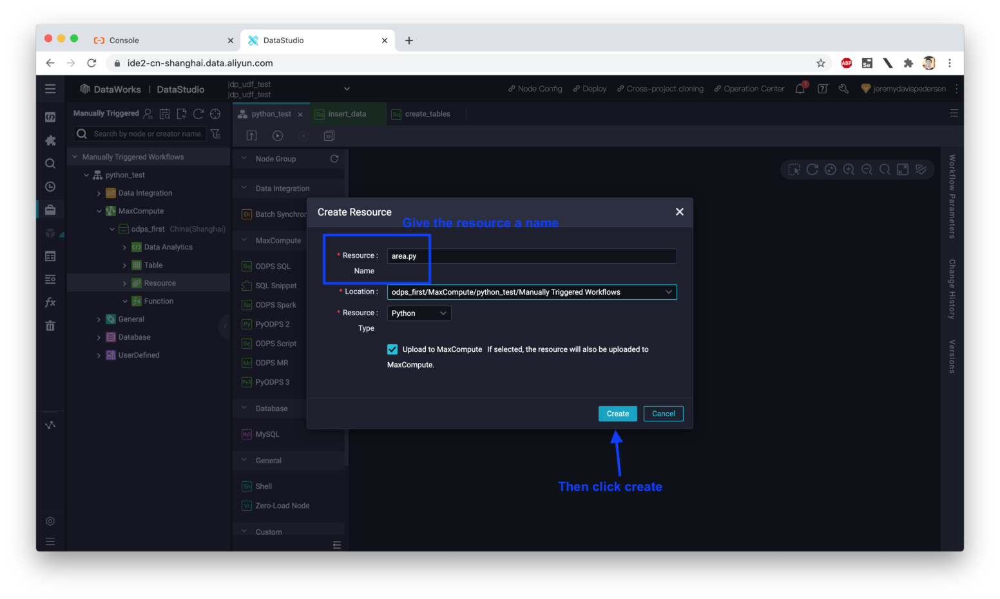

# MaxCompute UDF Python Functions: With Custom Libaries!

- Status: **OK**
- Notes: Code tested and working as of 2021-01-20 (YYYY-MM-DD)

## What

This is a quick how-to (and demo Python code) showing how you can implement a Python UDF function in a MaxCompute project which includes additional Python dependencies (external libraries) not provided by the default MaxCompute Python UDF runtime environment.

## How

### Create a DataWorks Workspace

First, you'll need to open up the [Alibaba Cloud Console](https://www.alibabacloud.com) by clicking on "Log In" on the upper right hand side of the Alibaba Cloud homepage. Then, you'll need to locate the DataWorks console and create a new Workspace:


### Set up some test tables

Create two tables, one to hold the radii of circles (input data), and another to hold their areas, which we will calculate using a 3rd party library (NumPy) added to a Python 3 UDF function (more on that later). 

First, set up a new Ad-hoc Query:


Once the Ad-hoc Query window opens, paste in the following MaxCompute SQL code, then hit the "Run" button near the top of the Ad-hoc Query Window:

```sql
CREATE TABLE IF NOT EXISTS circle_data (
    id BIGINT COMMENT 'circle id number',
    radius DOUBLE COMMENT 'circle radius'
);

-- Result table containing the info from circle_data, plus calculated areas
CREATE TABLE IF NOT EXISTS circle_data_out (
    id BIGINT COMMENT 'circle id number',
    radius DOUBLE COMMENT 'circle radius',
    area DOUBLE COMMENT 'circle area'
);
```

Next, create an additional Ad-hoc Query window, which we'll use to insert some test data into the `circle_data` table:


The SQL code you should paste in is here:

```sql
INSERT INTO TABLE circle_data (id, radius) VALUES (0, 1.5);
INSERT INTO TABLE circle_data (id, radius) VALUES (1, 2.0);
INSERT INTO TABLE circle_data (id, radius) VALUES (2, 3.0);
INSERT INTO TABLE circle_data (id, radius) VALUES (3, 2.5);
INSERT INTO TABLE circle_data (id, radius) VALUES (4, 0.9);
```

### Create a new Workflow

We need to create a new DataWorks Workflow where we can upload our Python code and associated 3rd party libary code (NumPy). We can do this from the "Manually Triggered Workflows" area in the DataStudio console:


### Upload resources

Next, we need to upload our Python code. Right click on "Resources", then choose "Create -> Python":




A new dialog should open:


Paste the following code into the dialog:

```python
from odps.udf import annotate
@annotate("double->double")
class area(object):
    def __init__(self):
        import sys
        sys.path.insert(0, 'work/numpy-1.19.5-cp37-cp37m-manylinux1_x86_64.zip') # Our NumPy package

    def evaluate(self, arg0):
       import numpy as np
       if arg0 is None:
           return None
       # Calculate area of the circle
       return np.pi * (arg0 * arg0)
```

### Add the NumPy library 

We want to include a NumPy package in our Python 3 UDF. The package we are using for this example is `numpy-1.19.5-cp37-cp37m-manylinux1_x86_64`. You can get a copy [here](https://pypi.org/project/numpy/#files). 

Note that it is **very important** to make sure the package name includes "cp37" since the package needs to be built using the same version of CPython used by MaxCompute. When you download this file, the extension will be `.whl` (it's a wheel file). Change the extension to `.zip`, then upload the file as a resource:


Note that after you upload the NumPy .zip file but *before* you click "Create", you should see something like this:


### Create and register a new UDF

Now we have our Python code and our NumPy library .zip file. It's time to register a UDF function! Right click on "Function" as shown in the image below, then click on "Create Solution"


This will open up the function creation dialog:


After you've given the function a name, you need to tell MaxCompute which resources it depends on:


### Try out our new UDF function

Coming soon.

### Cleaning Up

When you're done, just delete the DataWorks Workspace and that's it! All the related resources (MaxCompute project, tables, functions) will be automatically released.

## Issues

None yet! If you find one let us know. 

## Credits

I drew some inspiration from this [LabEx lab](https://labex.io/courses/use-maxcompute-studio-to-develop-python-udfs) on creating Python UDF functions, though I chose to use the DataWorks interface rather than IntelliJ. 

[This document](https://www.alibabacloud.com/help/doc-detail/189752.htm) on adding custom libraries to Python 3 UDFs was also referenced heavily as I wrote this tutorial.

